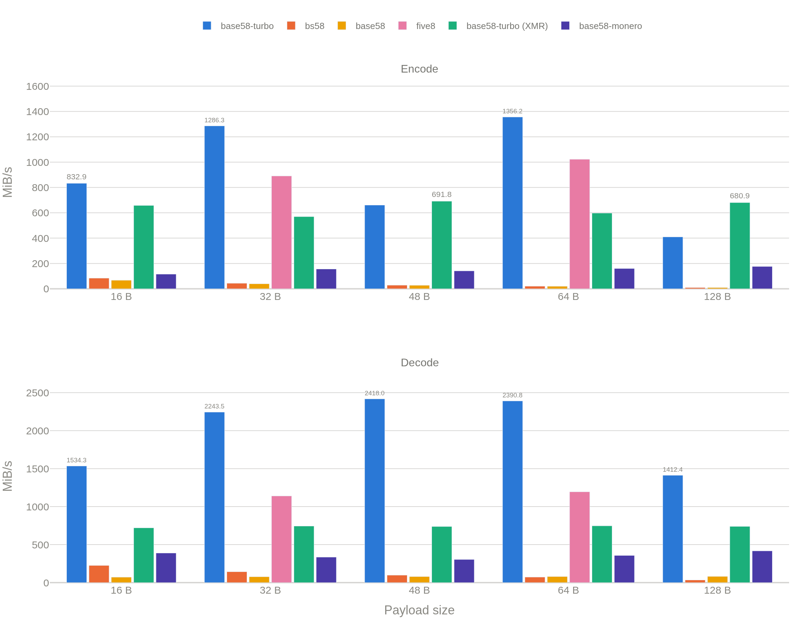
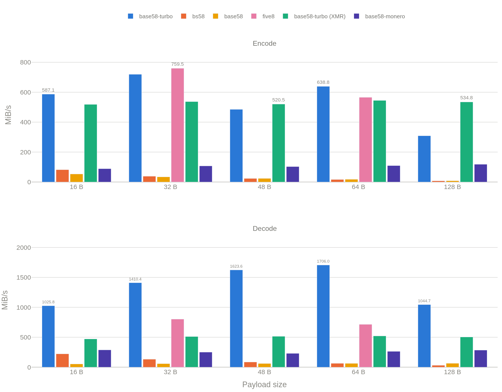

<div align="center">
  <h1>Base58 Turbo</h1>
  <p><strong>A Rust Base58 codec that decodes past 2 GiB/s, with matrix-multiplication scalar kernels and an optional AVX2 path on x86/x86-64.</strong></p>

  [](https://crates.io/crates/base58-turbo)
  [](https://crates.io/crates/base58-turbo)
  [](https://github.com/hacer-bark/base58-turbo/actions/workflows/tests.yml)
</div>

<br/>

`base58-turbo` targets systems where CPU cycles are scarce. The default build enables the `unsafe-simd` feature, which on x86/x86-64 adds one `unsafe` AVX2 module (`src/simd.rs`) — the only `unsafe` in the crate; every other target, and any build with `unsafe-simd` turned off, is `#![forbid(unsafe_code)]`. See [Safety & Verification](#safety--verification) for exactly what that guarantees and how to get it.

In the chart below, `base58-turbo` leads `bs58`, `base58`, `base58-monero`, and `five8` — the other SIMD-using library benchmarked — at every size. Decode is where it separates furthest: it peaks past 2 GiB/s, over 2x `five8`'s best and more than 20x `bs58`. See [Benchmarks](#benchmarks) for the exact numbers.



<p align="center"><sub>AWS <code>c8a.large</code> (AMD EPYC 9R45). See <a href="#benchmarks">Benchmarks</a> for the same sweep on a smaller/cheaper box, and for how to reproduce either.</sub></p>

## Quick Start

### Encoding

```rust
use base58_turbo::BITCOIN;

fn main() {
    let data = b"Hello World";

    // Returns Result<String, Error>
    let encoded = BITCOIN.encode(data).unwrap();

    assert_eq!(encoded, "JxF12TrwUP45BMd");
}
```

### Decoding

```rust
use base58_turbo::BITCOIN;

fn main() {
    let encoded = "JxF12TrwUP45BMd";

    // Returns Result<Vec<u8>, Error>
    let decoded = BITCOIN.decode(encoded).unwrap();

    assert_eq!(decoded, b"Hello World");
}
```

### Zero-Allocation (Stack)

For scenarios where heap allocation is too slow (e.g., hot paths), write directly to stack buffers:

```rust
use base58_turbo::BITCOIN;

fn main() {
    let input = b"Hello World";
    let mut output = [0u8; 64];

    // Returns Result<usize, Error>
    let len = BITCOIN.encode_into(input, &mut output).unwrap();
    let encoded = std::str::from_utf8(&output[..len]).unwrap();

    assert_eq!(encoded, "JxF12TrwUP45BMd");
}
```

### Native Monero Chunking (XMR)

`base58-turbo` includes native, highly-optimized support for Monero's specific block-chunked Base58 format. This processes payload strictly in 8-byte blocks padded to 11 characters. 

```rust
use base58_turbo::xmr;

fn main() {
    let payload = b"Hello World"; // Typically 69-byte addresses
    
    // Returns Result<String, Error>
    let encoded = xmr::encode(payload).unwrap();
    
    // Returns Result<Vec<u8>, Error>
    let decoded = xmr::decode(&encoded).unwrap();
}
```

Zero-allocation `xmr::encode_into` and `xmr::decode_into` APIs are also provided!

## Engines

Supports multiple Base58 alphabets:
- `BITCOIN`: Standard Bitcoin alphabet.
- `MONERO`: Monero alphabet.
- `RIPPLE`: Ripple alphabet.
- `FLICKR`: Flickr alphabet.
- `Engine::new(&[u8; 58])`: Custom alphabets.

## Compatibility & Stability

### Minimum Supported Rust Version (MSRV)
**This crate requires Rust 1.87.0 or newer.**

### Public API Stability
The public API (traits, structs, and error types) is considered **Stable**.
*   We adhere to **Semantic Versioning**.
*   The current API surface will remain valid and backward-compatible throughout the `0.3.x` lifecycle.

### Benchmarks

The chart at the top of this README and the numbers below are straight from a `cargo bench` run — same numbers, no cherry-picking. It compares `base58-turbo` against `bs58`, `base58`, `five8`, and `base58-monero` (`benches/encoding_bench.rs`) across payload sizes from 16 to 128 bytes. `five8` only ships fixed-width 32/64-byte encoders. The run uses default features, so `Turbo`/`Turbo_XMR` include the `unsafe-simd` AVX2 path — run with `--no-default-features --features std` to bench the forbid-`unsafe` scalar kernels alone.

**AWS `c8a.large` (AMD EPYC 9R45), the chart above:** at 48 bytes, `base58-turbo` decodes at 2.36 GiB/s, vs 97.9 MiB/s for `bs58` (+2369%) and 79.2 MiB/s for `base58` (+2954%) — over 20x either. Against `five8`, the other SIMD-using library benchmarked, decode wins at both sizes it supports (2.19 vs 1.11 GiB/s at 32 B, +97%; 2.34 vs 1.17 GiB/s at 64 B, +100%), and encode wins too on this box (1.26 vs 0.87 GiB/s at 32 B, +44%; 1.32 vs 1.00 GiB/s at 64 B, +33%). The XMR path (block-chunked, so slower than the flat encoder) still holds a wide lead over `base58-monero`: +142% decode, +390% encode at 48 bytes. The sweep peaks at 2.36 GiB/s (decode, 48 B) — comfortably past 2 GiB/s, single-threaded.

**AWS `c7i.large` (Intel Xeon Platinum 8488C), a smaller/cheaper box, run the same way:**



At 48 bytes: 1.59 GiB/s decode, vs 84 MiB/s for `bs58` (+1790%) and 60 MiB/s for `base58` (+2553%). Against `five8`: decode still wins clearly (1.38 vs 0.78 GiB/s at 32 B, +76%; 1.67 vs 0.70 GiB/s at 64 B, +139%), but encode is closer and `five8` edges ahead at 32 B (0.70 vs 0.74 GiB/s, -5%) before `base58-turbo` retakes the lead at 64 B (0.62 vs 0.55 GiB/s, +13%). The two machines agree on the shape of the curve (same relative ordering of libraries, same dip pattern across sizes) and disagree by roughly 1.5x on the absolute ceiling — which is the point: the 2 GiB/s+ figure is a real peak on real hardware, not a property of the algorithm that holds everywhere.

Measured on a fresh checkout with nothing else running:

```bash
sudo apt update && sudo apt install -y build-essential git
curl --proto '=https' --tlsv1.3 -sSf https://sh.rustup.rs | sh -s -- -y
source "$HOME/.cargo/env"

git clone https://github.com/hacer-bark/base58-turbo
cd base58-turbo
RUSTFLAGS="-C target-cpu=native" BENCH_TARGET=all cargo bench 2>&1 | tee benches/results/raw.txt
python3 benches/scripts/plot_bench.py benches/results/raw.txt
```

<details>
<summary>Raw <code>cargo bench</code> output — AWS <code>c8a.large</code> (AMD EPYC 9R45)</summary>

```ignore
Benchmarking Base58_Performances/Encode/Turbo/16
  time:   [18.318 ns 18.321 ns 18.324 ns]
  thrpt:  [832.72 MiB/s 832.87 MiB/s 833.01 MiB/s]

Benchmarking Base58_Performances/Encode/bs58/16
  time:   [181.54 ns 181.55 ns 181.56 ns]
  thrpt:  [84.042 MiB/s 84.048 MiB/s 84.053 MiB/s]

Benchmarking Base58_Performances/Encode/base58/16
  time:   [226.59 ns 226.68 ns 226.78 ns]
  thrpt:  [67.284 MiB/s 67.314 MiB/s 67.340 MiB/s]

Benchmarking Base58_Performances/Encode/Turbo_XMR/16
  time:   [23.157 ns 23.191 ns 23.219 ns]
  thrpt:  [657.18 MiB/s 657.95 MiB/s 658.92 MiB/s]

Benchmarking Base58_Performances/Encode/base58_monero/16
  time:   [131.54 ns 131.62 ns 131.72 ns]
  thrpt:  [115.84 MiB/s 115.93 MiB/s 116.00 MiB/s]

Benchmarking Base58_Performances/Decode/Turbo/16
  time:   [13.649 ns 13.675 ns 13.696 ns]
  thrpt:  [1.4960 GiB/s 1.4983 GiB/s 1.5012 GiB/s]

Benchmarking Base58_Performances/Decode/bs58/16
  time:   [92.851 ns 92.859 ns 92.867 ns]
  thrpt:  [225.92 MiB/s 225.94 MiB/s 225.96 MiB/s]

Benchmarking Base58_Performances/Decode/base58/16
  time:   [292.31 ns 292.42 ns 292.49 ns]
  thrpt:  [71.732 MiB/s 71.750 MiB/s 71.775 MiB/s]

Benchmarking Base58_Performances/Decode/Turbo_XMR/16
  time:   [29.103 ns 29.129 ns 29.164 ns]
  thrpt:  [719.41 MiB/s 720.27 MiB/s 720.91 MiB/s]

Benchmarking Base58_Performances/Decode/base58_monero/16
  time:   [53.779 ns 53.895 ns 53.981 ns]
  thrpt:  [388.67 MiB/s 389.29 MiB/s 390.13 MiB/s]

Benchmarking Base58_Performances/Encode/Turbo/32
  time:   [23.721 ns 23.724 ns 23.728 ns]
  thrpt:  [1.2560 GiB/s 1.2562 GiB/s 1.2564 GiB/s]

Benchmarking Base58_Performances/Encode/bs58/32
  time:   [702.11 ns 702.16 ns 702.21 ns]
  thrpt:  [43.460 MiB/s 43.463 MiB/s 43.466 MiB/s]

Benchmarking Base58_Performances/Encode/base58/32
  time:   [769.82 ns 770.05 ns 770.35 ns]
  thrpt:  [39.615 MiB/s 39.631 MiB/s 39.642 MiB/s]

Benchmarking Base58_Performances/Encode/five8/32
  time:   [34.251 ns 34.253 ns 34.255 ns]
  thrpt:  [890.90 MiB/s 890.96 MiB/s 891.01 MiB/s]

Benchmarking Base58_Performances/Encode/Turbo_XMR/32
  time:   [53.451 ns 53.556 ns 53.694 ns]
  thrpt:  [568.36 MiB/s 569.82 MiB/s 570.94 MiB/s]

Benchmarking Base58_Performances/Encode/base58_monero/32
  time:   [195.25 ns 195.60 ns 196.21 ns]
  thrpt:  [155.54 MiB/s 156.02 MiB/s 156.30 MiB/s]

Benchmarking Base58_Performances/Decode/Turbo/32
  time:   [18.690 ns 18.704 ns 18.727 ns]
  thrpt:  [2.1882 GiB/s 2.1909 GiB/s 2.1925 GiB/s]

Benchmarking Base58_Performances/Decode/bs58/32
  time:   [293.63 ns 293.65 ns 293.67 ns]
  thrpt:  [142.89 MiB/s 142.90 MiB/s 142.91 MiB/s]

Benchmarking Base58_Performances/Decode/base58/32
  time:   [544.14 ns 544.17 ns 544.20 ns]
  thrpt:  [77.107 MiB/s 77.112 MiB/s 77.116 MiB/s]

Benchmarking Base58_Performances/Decode/five8/32
  time:   [36.789 ns 36.795 ns 36.801 ns]
  thrpt:  [1.1135 GiB/s 1.1137 GiB/s 1.1139 GiB/s]

Benchmarking Base58_Performances/Decode/Turbo_XMR/32
  time:   [56.386 ns 56.389 ns 56.394 ns]
  thrpt:  [744.08 MiB/s 744.14 MiB/s 744.19 MiB/s]

Benchmarking Base58_Performances/Decode/base58_monero/32
  time:   [124.83 ns 124.96 ns 125.13 ns]
  thrpt:  [335.35 MiB/s 335.81 MiB/s 336.15 MiB/s]

Benchmarking Base58_Performances/Encode/Turbo/48
  time:   [69.265 ns 69.277 ns 69.291 ns]
  thrpt:  [660.64 MiB/s 660.77 MiB/s 660.89 MiB/s]

Benchmarking Base58_Performances/Encode/bs58/48
  time:   [1.5966 µs 1.5967 µs 1.5967 µs]
  thrpt:  [28.669 MiB/s 28.670 MiB/s 28.672 MiB/s]

Benchmarking Base58_Performances/Encode/base58/48
  time:   [1.6733 µs 1.6737 µs 1.6742 µs]
  thrpt:  [27.342 MiB/s 27.350 MiB/s 27.358 MiB/s]

Benchmarking Base58_Performances/Encode/Turbo_XMR/48
  time:   [66.081 ns 66.166 ns 66.232 ns]
  thrpt:  [691.15 MiB/s 691.84 MiB/s 692.73 MiB/s]

Benchmarking Base58_Performances/Encode/base58_monero/48
  time:   [322.86 ns 323.90 ns 325.54 ns]
  thrpt:  [140.61 MiB/s 141.33 MiB/s 141.79 MiB/s]

Benchmarking Base58_Performances/Decode/Turbo/48
  time:   [25.615 ns 25.637 ns 25.656 ns]
  thrpt:  [2.3596 GiB/s 2.3613 GiB/s 2.3633 GiB/s]

Benchmarking Base58_Performances/Decode/bs58/48
  time:   [632.91 ns 632.95 ns 633.00 ns]
  thrpt:  [97.929 MiB/s 97.936 MiB/s 97.942 MiB/s]

Benchmarking Base58_Performances/Decode/base58/48
  time:   [782.85 ns 783.04 ns 783.29 ns]
  thrpt:  [79.139 MiB/s 79.164 MiB/s 79.184 MiB/s]

Benchmarking Base58_Performances/Decode/Turbo_XMR/48
  time:   [83.961 ns 84.004 ns 84.051 ns]
  thrpt:  [737.52 MiB/s 737.93 MiB/s 738.31 MiB/s]

Benchmarking Base58_Performances/Decode/base58_monero/48
  time:   [203.36 ns 203.62 ns 204.09 ns]
  thrpt:  [303.73 MiB/s 304.43 MiB/s 304.83 MiB/s]

Benchmarking Base58_Performances/Encode/Turbo/64
  time:   [45.003 ns 45.006 ns 45.008 ns]
  thrpt:  [1.3243 GiB/s 1.3244 GiB/s 1.3245 GiB/s]

Benchmarking Base58_Performances/Encode/bs58/64
  time:   [2.9601 µs 2.9604 µs 2.9608 µs]
  thrpt:  [20.615 MiB/s 20.617 MiB/s 20.620 MiB/s]

Benchmarking Base58_Performances/Encode/base58/64
  time:   [3.0690 µs 3.0699 µs 3.0710 µs]
  thrpt:  [19.875 MiB/s 19.882 MiB/s 19.888 MiB/s]

Benchmarking Base58_Performances/Encode/five8/64
  time:   [59.673 ns 59.685 ns 59.696 ns]
  thrpt:  [1022.4 MiB/s 1022.6 MiB/s 1022.8 MiB/s]

Benchmarking Base58_Performances/Encode/Turbo_XMR/64
  time:   [102.03 ns 102.13 ns 102.21 ns]
  thrpt:  [597.13 MiB/s 597.61 MiB/s 598.23 MiB/s]

Benchmarking Base58_Performances/Encode/base58_monero/64
  time:   [380.21 ns 381.32 ns 383.14 ns]
  thrpt:  [159.30 MiB/s 160.06 MiB/s 160.53 MiB/s]

Benchmarking Base58_Performances/Decode/Turbo/64
  time:   [34.589 ns 34.703 ns 34.778 ns]
  thrpt:  [2.3298 GiB/s 2.3348 GiB/s 2.3425 GiB/s]

Benchmarking Base58_Performances/Decode/bs58/64
  time:   [1.1434 µs 1.1435 µs 1.1436 µs]
  thrpt:  [72.552 MiB/s 72.560 MiB/s 72.566 MiB/s]

Benchmarking Base58_Performances/Decode/base58/64
  time:   [1.0372 µs 1.0372 µs 1.0373 µs]
  thrpt:  [79.986 MiB/s 79.991 MiB/s 79.996 MiB/s]

Benchmarking Base58_Performances/Decode/five8/64
  time:   [69.373 ns 69.418 ns 69.452 ns]
  thrpt:  [1.1666 GiB/s 1.1672 GiB/s 1.1680 GiB/s]

Benchmarking Base58_Performances/Decode/Turbo_XMR/64
  time:   [111.07 ns 111.11 ns 111.17 ns]
  thrpt:  [746.36 MiB/s 746.72 MiB/s 747.00 MiB/s]

Benchmarking Base58_Performances/Decode/base58_monero/64
  time:   [231.94 ns 232.12 ns 232.42 ns]
  thrpt:  [356.98 MiB/s 357.44 MiB/s 357.73 MiB/s]

Benchmarking Base58_Performances/Encode/Turbo/128
  time:   [298.10 ns 298.13 ns 298.16 ns]
  thrpt:  [409.41 MiB/s 409.45 MiB/s 409.49 MiB/s]

Benchmarking Base58_Performances/Encode/bs58/128
  time:   [12.523 µs 12.526 µs 12.530 µs]
  thrpt:  [9.7426 MiB/s 9.7451 MiB/s 9.7479 MiB/s]

Benchmarking Base58_Performances/Encode/base58/128
  time:   [12.597 µs 12.599 µs 12.601 µs]
  thrpt:  [9.6875 MiB/s 9.6889 MiB/s 9.6903 MiB/s]

Benchmarking Base58_Performances/Encode/Turbo_XMR/128
  time:   [179.16 ns 179.28 ns 179.37 ns]
  thrpt:  [680.54 MiB/s 680.90 MiB/s 681.35 MiB/s]

Benchmarking Base58_Performances/Encode/base58_monero/128
  time:   [691.23 ns 692.56 ns 694.67 ns]
  thrpt:  [175.72 MiB/s 176.26 MiB/s 176.60 MiB/s]

Benchmarking Base58_Performances/Decode/Turbo/128
  time:   [118.04 ns 118.16 ns 118.26 ns]
  thrpt:  [1.3782 GiB/s 1.3793 GiB/s 1.3807 GiB/s]

Benchmarking Base58_Performances/Decode/bs58/128
  time:   [4.8419 µs 4.8423 µs 4.8427 µs]
  thrpt:  [34.463 MiB/s 34.466 MiB/s 34.468 MiB/s]

Benchmarking Base58_Performances/Decode/base58/128
  time:   [2.0472 µs 2.0474 µs 2.0475 µs]
  thrpt:  [81.509 MiB/s 81.515 MiB/s 81.522 MiB/s]

Benchmarking Base58_Performances/Decode/Turbo_XMR/128
  time:   [225.42 ns 225.62 ns 225.82 ns]
  thrpt:  [739.04 MiB/s 739.71 MiB/s 740.36 MiB/s]

Benchmarking Base58_Performances/Decode/base58_monero/128
  time:   [399.03 ns 399.51 ns 400.38 ns]
  thrpt:  [416.84 MiB/s 417.74 MiB/s 418.25 MiB/s]
```

</details>

<details>
<summary>Raw <code>cargo bench</code> output — AWS <code>c7i.large</code> (Intel Xeon Platinum 8488C)</summary>

```ignore
Benchmarking Base58_Performances/Encode/Turbo/16
  time:   [25.960 ns 25.991 ns 26.023 ns]
  thrpt:  [586.36 MiB/s 587.07 MiB/s 587.78 MiB/s]

Benchmarking Base58_Performances/Encode/bs58/16
  time:   [185.54 ns 185.73 ns 185.93 ns]
  thrpt:  [82.065 MiB/s 82.156 MiB/s 82.239 MiB/s]

Benchmarking Base58_Performances/Encode/base58/16
  time:   [283.97 ns 286.35 ns 289.50 ns]
  thrpt:  [52.707 MiB/s 53.286 MiB/s 53.733 MiB/s]

Benchmarking Base58_Performances/Encode/Turbo_XMR/16
  time:   [29.392 ns 29.432 ns 29.483 ns]
  thrpt:  [517.55 MiB/s 518.44 MiB/s 519.14 MiB/s]

Benchmarking Base58_Performances/Encode/base58_monero/16
  time:   [171.68 ns 171.99 ns 172.27 ns]
  thrpt:  [88.575 MiB/s 88.717 MiB/s 88.879 MiB/s]

Benchmarking Base58_Performances/Decode/Turbo/16
  time:   [20.424 ns 20.453 ns 20.479 ns]
  thrpt:  [1.0005 GiB/s 1.0018 GiB/s 1.0032 GiB/s]

Benchmarking Base58_Performances/Decode/bs58/16
  time:   [94.220 ns 94.379 ns 94.542 ns]
  thrpt:  [221.92 MiB/s 222.30 MiB/s 222.68 MiB/s]

Benchmarking Base58_Performances/Decode/base58/16
  time:   [393.45 ns 393.87 ns 394.33 ns]
  thrpt:  [53.207 MiB/s 53.268 MiB/s 53.325 MiB/s]

Benchmarking Base58_Performances/Decode/Turbo_XMR/16
  time:   [44.453 ns 44.522 ns 44.592 ns]
  thrpt:  [470.50 MiB/s 471.25 MiB/s 471.98 MiB/s]

Benchmarking Base58_Performances/Decode/base58_monero/16
  time:   [72.795 ns 72.873 ns 72.941 ns]
  thrpt:  [287.64 MiB/s 287.91 MiB/s 288.22 MiB/s]

Benchmarking Base58_Performances/Encode/Turbo/32
  time:   [42.365 ns 42.413 ns 42.457 ns]
  thrpt:  [718.79 MiB/s 719.54 MiB/s 720.35 MiB/s]

Benchmarking Base58_Performances/Encode/bs58/32
  time:   [795.19 ns 795.86 ns 796.55 ns]
  thrpt:  [38.312 MiB/s 38.345 MiB/s 38.378 MiB/s]

Benchmarking Base58_Performances/Encode/base58/32
  time:   [892.14 ns 893.22 ns 894.17 ns]
  thrpt:  [34.130 MiB/s 34.166 MiB/s 34.207 MiB/s]

Benchmarking Base58_Performances/Encode/five8/32
  time:   [40.138 ns 40.181 ns 40.225 ns]
  thrpt:  [758.67 MiB/s 759.51 MiB/s 760.31 MiB/s]

Benchmarking Base58_Performances/Encode/Turbo_XMR/32
  time:   [56.745 ns 56.839 ns 56.949 ns]
  thrpt:  [535.88 MiB/s 536.92 MiB/s 537.80 MiB/s]

Benchmarking Base58_Performances/Encode/base58_monero/32
  time:   [283.70 ns 284.40 ns 285.12 ns]
  thrpt:  [107.04 MiB/s 107.31 MiB/s 107.57 MiB/s]

Benchmarking Base58_Performances/Decode/Turbo/32
  time:   [29.677 ns 29.753 ns 29.829 ns]
  thrpt:  [1.3738 GiB/s 1.3773 GiB/s 1.3808 GiB/s]

Benchmarking Base58_Performances/Decode/bs58/32
  time:   [317.27 ns 317.75 ns 318.22 ns]
  thrpt:  [131.86 MiB/s 132.06 MiB/s 132.26 MiB/s]

Benchmarking Base58_Performances/Decode/base58/32
  time:   [715.36 ns 719.70 ns 726.23 ns]
  thrpt:  [57.780 MiB/s 58.305 MiB/s 58.658 MiB/s]

Benchmarking Base58_Performances/Decode/five8/32
  time:   [52.240 ns 52.306 ns 52.379 ns]
  thrpt:  [801.12 MiB/s 802.23 MiB/s 803.25 MiB/s]

Benchmarking Base58_Performances/Decode/Turbo_XMR/32
  time:   [81.919 ns 82.043 ns 82.156 ns]
  thrpt:  [510.75 MiB/s 511.46 MiB/s 512.23 MiB/s]

Benchmarking Base58_Performances/Decode/base58_monero/32
  time:   [166.89 ns 167.23 ns 167.63 ns]
  thrpt:  [250.32 MiB/s 250.91 MiB/s 251.44 MiB/s]

Benchmarking Base58_Performances/Encode/Turbo/48
  time:   [94.215 ns 94.329 ns 94.436 ns]
  thrpt:  [484.73 MiB/s 485.29 MiB/s 485.87 MiB/s]

Benchmarking Base58_Performances/Encode/bs58/48
  time:   [1.9463 µs 1.9481 µs 1.9501 µs]
  thrpt:  [23.474 MiB/s 23.497 MiB/s 23.520 MiB/s]

Benchmarking Base58_Performances/Encode/base58/48
  time:   [1.9140 µs 1.9163 µs 1.9184 µs]
  thrpt:  [23.862 MiB/s 23.888 MiB/s 23.916 MiB/s]

Benchmarking Base58_Performances/Encode/Turbo_XMR/48
  time:   [87.848 ns 87.951 ns 88.066 ns]
  thrpt:  [519.79 MiB/s 520.48 MiB/s 521.08 MiB/s]

Benchmarking Base58_Performances/Encode/base58_monero/48
  time:   [443.99 ns 445.17 ns 446.17 ns]
  thrpt:  [102.60 MiB/s 102.83 MiB/s 103.10 MiB/s]

Benchmarking Base58_Performances/Decode/Turbo/48
  time:   [38.655 ns 38.770 ns 38.897 ns]
  thrpt:  [1.5803 GiB/s 1.5855 GiB/s 1.5901 GiB/s]

Benchmarking Base58_Performances/Decode/bs58/48
  time:   [732.11 ns 732.90 ns 733.67 ns]
  thrpt:  [85.792 MiB/s 85.882 MiB/s 85.974 MiB/s]

Benchmarking Base58_Performances/Decode/base58/48
  time:   [1.0276 µs 1.0286 µs 1.0297 µs]
  thrpt:  [61.128 MiB/s 61.190 MiB/s 61.249 MiB/s]

Benchmarking Base58_Performances/Decode/Turbo_XMR/48
  time:   [122.01 ns 122.22 ns 122.43 ns]
  thrpt:  [514.12 MiB/s 514.98 MiB/s 515.89 MiB/s]

Benchmarking Base58_Performances/Decode/base58_monero/48
  time:   [273.60 ns 274.05 ns 274.48 ns]
  thrpt:  [229.31 MiB/s 229.67 MiB/s 230.05 MiB/s]

Benchmarking Base58_Performances/Encode/Turbo/64
  time:   [95.392 ns 95.544 ns 95.712 ns]
  thrpt:  [637.70 MiB/s 638.82 MiB/s 639.84 MiB/s]

Benchmarking Base58_Performances/Encode/bs58/64
  time:   [3.6615 µs 3.6657 µs 3.6702 µs]
  thrpt:  [16.630 MiB/s 16.651 MiB/s 16.670 MiB/s]

Benchmarking Base58_Performances/Encode/base58/64
  time:   [3.4230 µs 3.4264 µs 3.4299 µs]
  thrpt:  [17.795 MiB/s 17.813 MiB/s 17.831 MiB/s]

Benchmarking Base58_Performances/Encode/five8/64
  time:   [107.75 ns 107.91 ns 108.09 ns]
  thrpt:  [564.69 MiB/s 565.60 MiB/s 566.44 MiB/s]

Benchmarking Base58_Performances/Encode/Turbo_XMR/64
  time:   [111.86 ns 111.99 ns 112.12 ns]
  thrpt:  [544.37 MiB/s 545.02 MiB/s 545.61 MiB/s]

Benchmarking Base58_Performances/Encode/base58_monero/64
  time:   [555.90 ns 557.83 ns 559.47 ns]
  thrpt:  [109.09 MiB/s 109.41 MiB/s 109.79 MiB/s]

Benchmarking Base58_Performances/Decode/Turbo/64
  time:   [49.057 ns 49.194 ns 49.332 ns]
  thrpt:  [1.6613 GiB/s 1.6660 GiB/s 1.6706 GiB/s]

Benchmarking Base58_Performances/Decode/bs58/64
  time:   [1.3208 µs 1.3220 µs 1.3233 µs]
  thrpt:  [63.421 MiB/s 63.484 MiB/s 63.538 MiB/s]

Benchmarking Base58_Performances/Decode/base58/64
  time:   [1.3431 µs 1.3448 µs 1.3466 µs]
  thrpt:  [62.323 MiB/s 62.406 MiB/s 62.486 MiB/s]

Benchmarking Base58_Performances/Decode/five8/64
  time:   [117.23 ns 117.39 ns 117.56 ns]
  thrpt:  [713.88 MiB/s 714.88 MiB/s 715.91 MiB/s]

Benchmarking Base58_Performances/Decode/Turbo_XMR/64
  time:   [160.82 ns 161.10 ns 161.36 ns]
  thrpt:  [520.10 MiB/s 520.94 MiB/s 521.84 MiB/s]

Benchmarking Base58_Performances/Decode/base58_monero/64
  time:   [318.28 ns 318.58 ns 318.86 ns]
  thrpt:  [263.20 MiB/s 263.43 MiB/s 263.68 MiB/s]

Benchmarking Base58_Performances/Encode/Turbo/128
  time:   [394.91 ns 395.42 ns 395.95 ns]
  thrpt:  [308.30 MiB/s 308.71 MiB/s 309.11 MiB/s]

Benchmarking Base58_Performances/Encode/bs58/128
  time:   [16.330 µs 16.350 µs 16.373 µs]
  thrpt:  [7.4554 MiB/s 7.4661 MiB/s 7.4754 MiB/s]

Benchmarking Base58_Performances/Encode/base58/128
  time:   [14.892 µs 14.904 µs 14.916 µs]
  thrpt:  [8.1841 MiB/s 8.1904 MiB/s 8.1970 MiB/s]

Benchmarking Base58_Performances/Encode/Turbo_XMR/128
  time:   [227.95 ns 228.27 ns 228.67 ns]
  thrpt:  [533.84 MiB/s 534.76 MiB/s 535.51 MiB/s]

Benchmarking Base58_Performances/Encode/base58_monero/128
  time:   [1.0284 µs 1.0329 µs 1.0365 µs]
  thrpt:  [117.77 MiB/s 118.18 MiB/s 118.70 MiB/s]

Benchmarking Base58_Performances/Decode/Turbo/128
  time:   [159.53 ns 159.75 ns 159.97 ns]
  thrpt:  [1.0188 GiB/s 1.0202 GiB/s 1.0216 GiB/s]

Benchmarking Base58_Performances/Decode/bs58/128
  time:   [5.4697 µs 5.4761 µs 5.4832 µs]
  thrpt:  [30.437 MiB/s 30.477 MiB/s 30.512 MiB/s]

Benchmarking Base58_Performances/Decode/base58/128
  time:   [2.5943 µs 2.5971 µs 2.6001 µs]
  thrpt:  [64.186 MiB/s 64.260 MiB/s 64.330 MiB/s]

Benchmarking Base58_Performances/Decode/Turbo_XMR/128
  time:   [330.24 ns 331.22 ns 332.04 ns]
  thrpt:  [502.63 MiB/s 503.88 MiB/s 505.37 MiB/s]

Benchmarking Base58_Performances/Decode/base58_monero/128
  time:   [586.09 ns 586.77 ns 587.42 ns]
  thrpt:  [284.11 MiB/s 284.43 MiB/s 284.76 MiB/s]
```

</details>

## Safety & Verification

`#![forbid(unsafe_code)]` is applied conditionally in `lib.rs`: it's active whenever `unsafe-simd` is off, or on any target other than x86/x86-64. In that configuration the compiler rejects any `unsafe` block anywhere in the crate — there is no pointer arithmetic and no manually-asserted invariant to audit, and every bounds check that matters to performance is elided by the compiler because the code is shaped to make that provable, not because it was told to trust itself.

**`unsafe-simd` is a default feature.** On x86/x86-64 it compiles in `src/simd.rs`, one module of AVX2 intrinsics reached only after a runtime AVX2 check, and it is the *only* `unsafe` code in the crate — no `unsafe` anywhere else, gated or not. If you need the compiler-enforced guarantee rather than taking that module on faith, add with:

```bash
cargo add base58-turbo --no-default-features --features std
```

which drops to the scalar kernels and reinstates `#![forbid(unsafe_code)]`. Runtime dispatch means enabling `unsafe-simd` never breaks correctness on hardware without AVX2 — it just leaves the scalar path as the fallback — so the tradeoff is purely "do you want that one module in your dependency tree," not a correctness or portability one.

Ordinary logic bugs are the other class of failure worth guarding against, in either configuration, which is what the test suite is for: exact conformance vectors, every kernel-dispatch and scratch-buffer boundary, randomized cross-validation against `bs58`, `base58`, `five8`, and `base58-monero`, and — with `unsafe-simd` on — the AVX2 kernels checked against an independent schoolbook implementation. See [.github/workflows/tests.yml](.github/workflows/tests.yml) for exactly what runs.

## Feature Flags

| Feature | Default | Description |
| :--- | :---: | :--- |
| `serde` | **No** | Enables `serde` serialization/deserialization for Config and Engine |
| `std` | **Yes** | Enables `String` and `Vec` support. Disable for `no_std` |
| `unsafe-simd` | **Yes** | AVX2 encoding/decoding kernels on x86/x86-64, selected at runtime. Adds the crate's only `unsafe` code; no effect on other targets. Disable for `#![forbid(unsafe_code)]`. |

## License

Licensed under either of

- [Apache License, Version 2.0](https://github.com/hacer-bark/base58-turbo/blob/main/LICENSE-APACHE)
- [MIT license](https://github.com/hacer-bark/base58-turbo/blob/main/LICENSE-MIT)

at your option.

Unless you explicitly state otherwise, any contribution intentionally submitted for inclusion in
this crate, as defined in the Apache-2.0 license, shall be dual licensed as above, without any
additional terms or conditions.
